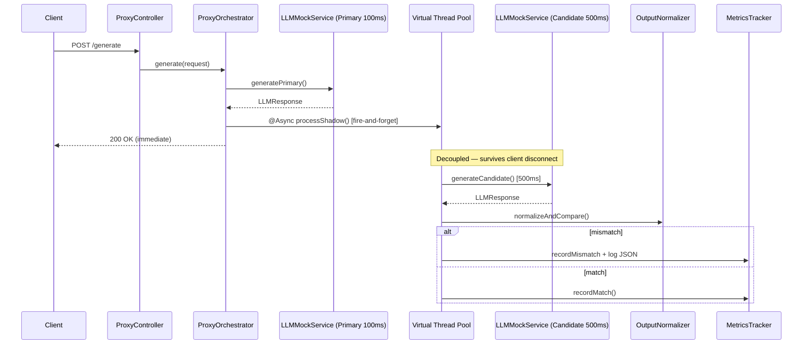

# Shadow LLM Proxy

A high-throughput, low-latency **LLM Shadow Proxy** built with **Java 21**, **Spring Boot 3.x**, and **Gradle**.

Customer traffic is served synchronously through a **Primary LLM** while an asynchronous **shadow request** runs against a **Candidate LLM** on Java 21 virtual threads. Mismatched outputs are logged; real-time metrics are exposed instantly.

## Quick Start

```bash
./gradlew bootRun
```

```bash
# Generate (primary path ~100ms; candidate shadow runs in background ~500ms)
curl -s -X POST http://localhost:8080/generate \
  -H "Content-Type: application/json" \
  -d '{"prompt":"Hello, world!"}'

# Real-time metrics
curl -s http://localhost:8080/metrics

# Health
curl -s http://localhost:8080/actuator/health
```

## Architecture



## Project Structure

```
src/main/java/com/digitalocean/llmproxy/
├── config/
│   ├── AsyncConfig.java          # Java 21 VirtualThreadTaskExecutor
│   └── RestClientConfig.java     # RestClient with explicit primary/candidate timeouts
├── controller/
│   ├── MockLlmInternalController.java  # In-process mock LLM HTTP endpoints
│   └── ProxyController.java      # POST /generate, GET /metrics
├── exception/
│   └── GlobalExceptionHandler.java
├── model/
│   ├── PromptRequest.java
│   ├── LLMResponse.java
│   └── MetricsSnapshot.java
├── service/
│   ├── LLMMockService.java       # Primary 100ms / Candidate 500ms simulation
│   ├── ShadowProcessor.java      # Async shadow + normalizeAndCompare()
│   ├── MetricsTracker.java       # CounterStore-backed shadow metrics
│   └── ProxyOrchestrator.java    # Sync primary + fire-and-forget shadow
├── metrics/
│   ├── CounterStore.java         # Pluggable counter storage (memory or Redis)
│   ├── InMemoryCounterStore.java
│   └── RedisCounterStore.java
├── support/
│   └── InstanceIdentity.java     # Container hostname for /metrics instance_id
└── util/
    └── OutputNormalizer.java     # Markdown strip, JSON canonicalization, text normalize
```

## Key Design Decisions

| Requirement | Implementation |
|-------------|----------------|
| Thread decoupling | `@Async("shadowTaskExecutor")` on `VirtualThreadTaskExecutor` |
| Primary non-blocking | Fire-and-forget shadow; primary never awaits candidate |
| Client disconnect safe | Shadow work scheduled before response flush on virtual thread |
| Candidate failure isolation | Caught in `ShadowProcessor`; increments `candidate_failures` only |
| External LLM calls | `RestClient` with 500ms primary / 2000ms candidate timeouts |
| Normalization pipeline | Strip markdown, canonical JSON, collapse whitespace, lowercase, strip punctuation |
| Thread-safe metrics | `CounterStore` with lock-free in-memory or Redis cluster totals |
| Production sampling | `prod` profile shadows ~10% of traffic (`llm.shadow.sample-rate: 0.1`) |
| Multi-instance metrics | `scope: instance` per JVM by default; use `metrics.store=redis` for cluster totals |

## Normalization Pipeline

Before comparing outputs, `OutputNormalizer`:

1. Extracts assistant content from chat-completion JSON envelopes
2. Strips ` ```json ` markdown blocks
3. Parses JSON and serializes with sorted keys (deterministic)
4. Collapses duplicate whitespace/newlines
5. Lowercases and strips trailing punctuation

Formatting-only differences do **not** trigger false mismatches.

## Test Flags

```json
{"prompt": "test", "force_mismatch": true}
{"prompt": "test", "simulate_candidate_failure": true}
```

## Testing

```bash
./gradlew test
```

| Test | Verifies |
|------|----------|
| `OutputNormalizerTest` | Markdown, JSON key order, whitespace, punctuation edge cases |
| `ProxyIntegrationTest` | `/generate` responds in **<150ms** while candidate takes 500ms+ |
| `MetricsTrackerTest` | Lock-free match rate calculation |
| `ProxyControllerTest` | WebMvc slice for API contract |

## Configuration

```yaml
llm:
  mock:
    primary-delay-ms: 100
    candidate-delay-ms: 500
  timeout:
    primary-ms: 500      # Primary connection/processing budget
    candidate-ms: 2000   # Candidate shadow timeout budget
  shadow:
    enabled: true
    sample-rate: 1.0       # 1.0 = shadow every request; prod profile uses 0.1

metrics:
  store: memory            # memory (per instance) or redis (cluster-wide)
```

### Spring profiles

| Profile | Use | Shadow sample rate | Security |
|---------|-----|-------------------|----------|
| `mock` (default locally) | Dev / integration | 100% | Disabled |
| `prod` | App Platform / production | 10% | API key required |
| `dev` | Verbose logging | Inherits base | Configurable |

Override sample rate for demos: `LLM_SHADOW_SAMPLE_RATE=1.0` or `llm.shadow.sample-rate` in config.

## CI/CD

GitHub Actions runs `./gradlew build` on Java 21 for every push/PR.

## Deploy to DigitalOcean

```bash
cp deploy/.env.example deploy/.env
./deploy/agent.sh
```

See [deploy/REQUIREMENTS.md](deploy/REQUIREMENTS.md) and [DEPLOY.md](DEPLOY.md).

## Publish to GitHub

Auto-publish creates the GitHub repo if missing, or pushes updates. See **[GITHUB_PUBLISH.md](GITHUB_PUBLISH.md)** for the full setup guide.

```bash
gh auth login
./scripts/publish-to-github.sh
```

Build/run commands: [BUILD.md](BUILD.md). Architecture: [ARCHITECTURE.md](ARCHITECTURE.md).

## API Reference

### `POST /generate`

**Request:**
```json
{"prompt": "Explain virtual threads"}
```

**Response:**
```json
{
  "request_id": "uuid",
  "model": "primary-mock",
  "content": "Answer: Explain virtual threads",
  "latency_ms": 102
}
```

### `GET /metrics`

Returns shadow-comparison counters. Updates **after** background candidate work completes (~500 ms), not when `/generate` returns.

```json
{
  "total_shadow_requests": 10,
  "matches": 8,
  "mismatches": 2,
  "candidate_failures": 0,
  "shadow_dropped": 0,
  "shadow_skipped": 90,
  "real_time_match_rate": 80.0,
  "instance_id": "api-7f3a2b1c",
  "scope": "instance"
}
```

| Field | Meaning |
|-------|---------|
| `total_shadow_requests` | Candidate invoked and compared |
| `shadow_skipped` | Request passed sampling (`sample-rate` < 1.0) |
| `shadow_dropped` | Concurrency limit reached; shadow not run |
| `instance_id` | Hostname of the container that served this snapshot |
| `scope` | `"instance"` (per-JVM counters) or `"cluster"` (Redis-backed totals) |

**Behind a load balancer:** With `metrics.store=memory`, each instance keeps its own counters — repeated `GET /metrics` calls may return different values. Use `metrics.store=redis` (see [DEPLOY.md](DEPLOY.md)) or scale to one instance for consistent totals.
